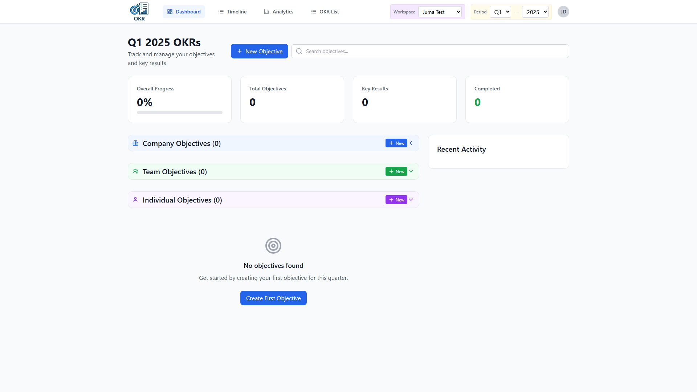
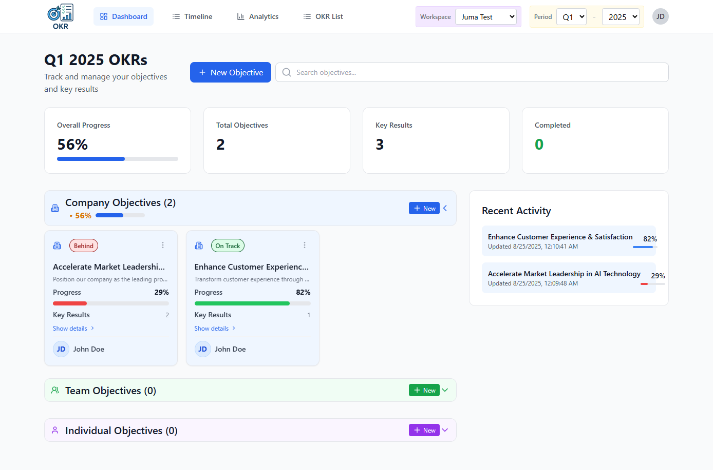
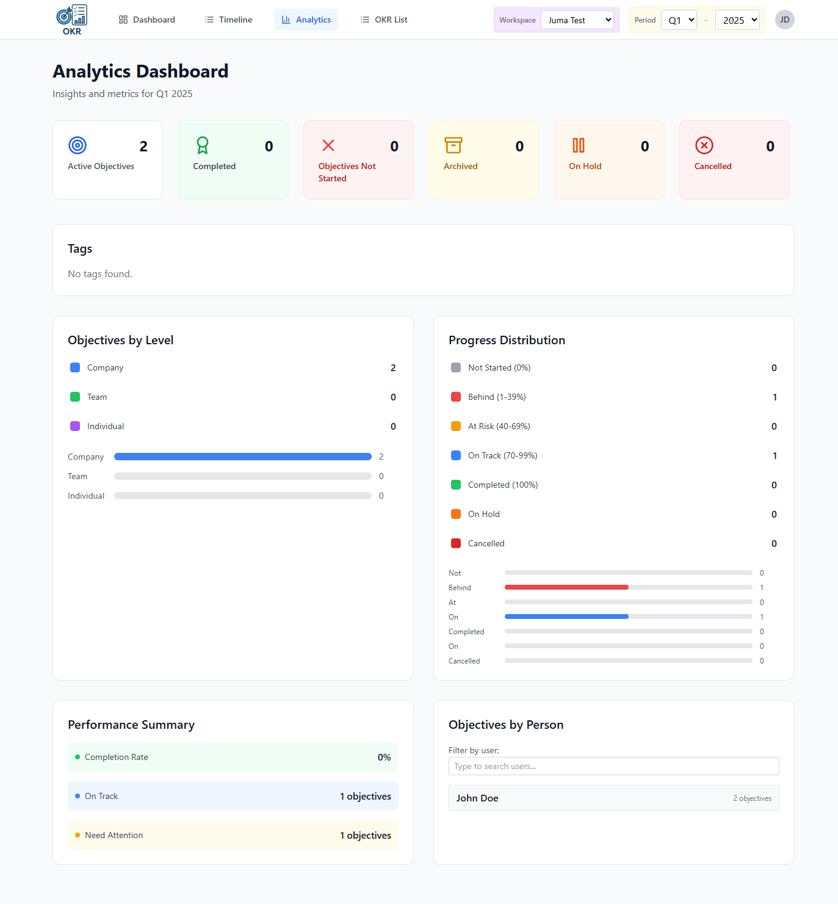
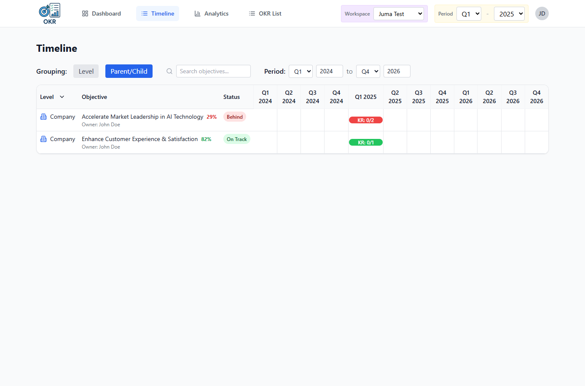
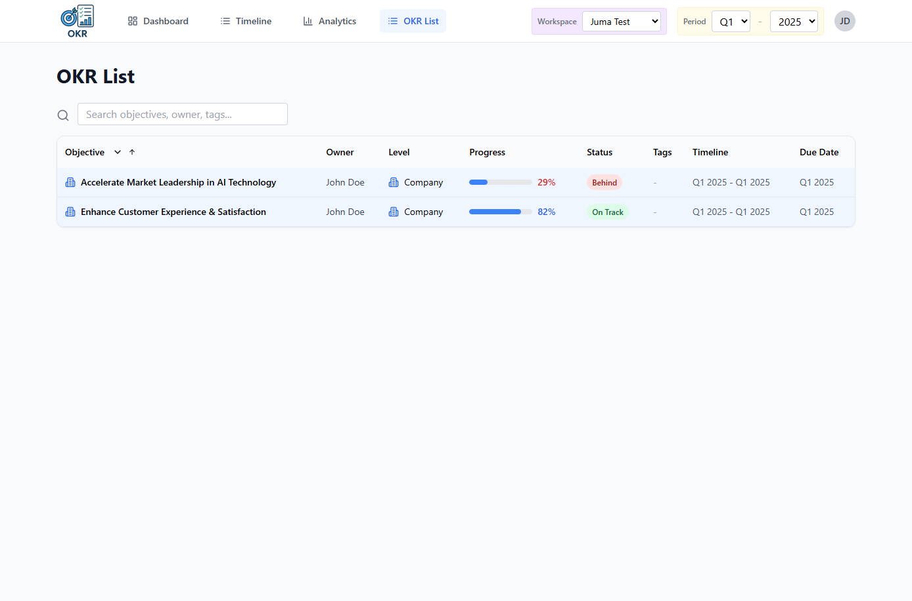
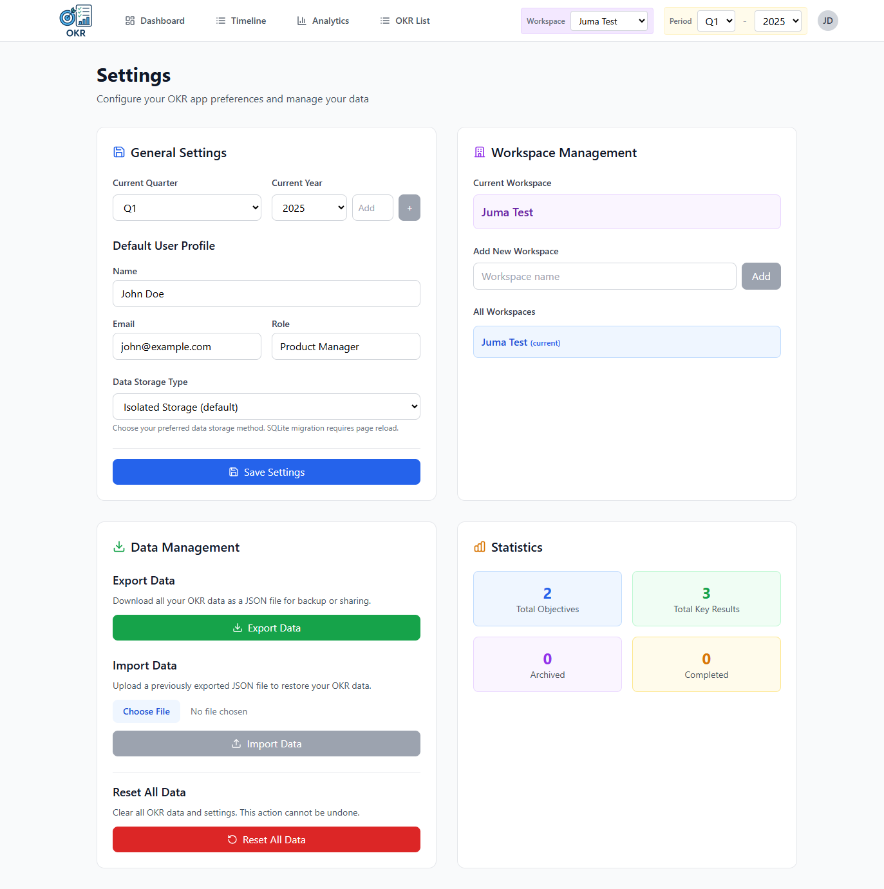
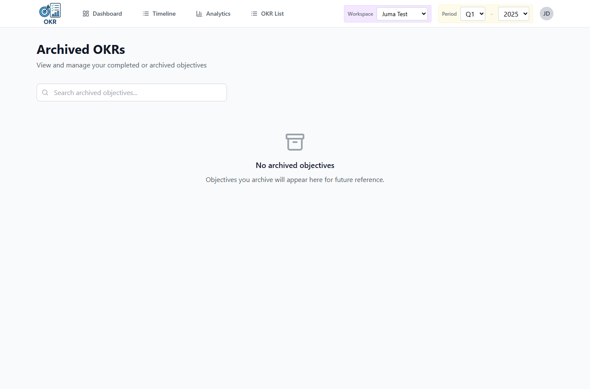

# OKR Management Application

A comprehensive React-based Objectives and Key Results (OKR) management system built with TypeScript, featuring hierarchical OKR structures, progress tracking, analytics, and dual storage support.



## 📋 Table of Contents

- [Overview](#overview)
- [Screenshots](#screenshots)
- [Architecture](#architecture)
- [Technology Stack](#technology-stack)
- [Project Structure](#project-structure)
- [Key Features](#key-features)
- [Design Decisions](#design-decisions)
- [Development Setup](#development-setup)
- [Storage System](#storage-system)
- [Data Models](#data-models)
- [Component Architecture](#component-architecture)
- [Testing](#testing)
- [Contributing](#contributing)

## 🌟 Overview

This application provides a modern, intuitive interface for managing OKRs (Objectives and Key Results) at Company, Team, and Individual levels. It features hierarchical objective management, automatic progress rollup, comprehensive analytics, and flexible storage options.

### Key Capabilities
- **Hierarchical OKRs**: Support for parent-child objective relationships
- **Automatic Progress Rollup**: Child progress automatically affects parent progress
- **Multi-Workspace Support**: Isolated workspaces for different teams/contexts
- **Dual Storage System**: Choose between localStorage (isolated) and SQLite (indexed)
- **Dark/Light Theme**: Complete theme support across all components
- **Comprehensive Analytics**: Visual dashboards with progress tracking
- **Timeline Management**: Gantt chart view for timeline visualization
- **Archive System**: Archive completed/cancelled objectives while preserving data

## 📸 Screenshots

### Dashboard View
The main dashboard showing active objectives with comprehensive test data, progress tracking, and key metrics.



### Analytics Dashboard
Rich analytics interface displaying progress distribution, performance metrics, and insights with real OKR data.



### Timeline/Gantt Chart View
Interactive timeline showing objectives across quarters with visual progress indicators and organizational levels.



### OKR List View  
Comprehensive table view listing all objectives with sortable columns, progress indicators, and status tracking.



### Settings & Configuration
Complete settings interface featuring workspace management, data export/import, user profiles, and system statistics.



### Archive View
Archive management interface for viewing and managing completed or discontinued objectives.



## 🏗️ Architecture

The application follows a modern React architecture with TypeScript, emphasizing separation of concerns and maintainability.

### High-Level Architecture

```
┌─────────────────────────────────────────────────────────┐
│                    React App (App.tsx)                  │
├─────────────────────────────────────────────────────────┤
│                Header (Navigation & Theme)               │
├─────────────────────────────────────────────────────────┤
│                   View Components                        │
│  Dashboard | Analytics | Archive | Settings | Gantt     │
│           OKR List | Hierarchy                           │
├─────────────────────────────────────────────────────────┤
│              OKR Data Context Provider                   │
│        (State Management & Business Logic)              │
├─────────────────────────────────────────────────────────┤
│                  Data Store Layer                        │
│           localStorage ←→ SQLite Storage                 │
├─────────────────────────────────────────────────────────┤
│                   Utility Layer                          │
│          Calculations | Validations | Helpers           │
└─────────────────────────────────────────────────────────┘
```

### Data Flow

```
User Interaction
      ↓
View Component
      ↓
OKRDataContext Hook
      ↓
Business Logic (calculations, validations)
      ↓
Storage Layer (localStorage/SQLite)
      ↓
State Update
      ↓
UI Re-render
```

## 🛠️ Technology Stack

### Frontend Framework
- **React 18.3.1** - Modern React with hooks and concurrent features
- **TypeScript 5.5.3** - Type safety and improved developer experience
- **Vite 5.4.2** - Fast build tool and development server

### Styling & UI
- **Tailwind CSS 3.4.1** - Utility-first CSS framework
- **Lucide React 0.344.0** - Beautiful, customizable icons
- **tailwind-merge 3.3.1** - Utility for merging Tailwind classes

### Storage & Data
- **sql.js 1.13.0** - SQLite compiled to WebAssembly for browser use
- **IndexedDB** - Browser storage for SQLite database persistence
- **localStorage** - Alternative storage for isolated mode

### Development & Testing
- **Vitest 3.2.4** - Fast unit testing framework
- **React Testing Library 16.3.0** - Testing utilities for React components
- **ESLint 9.9.1** - Code linting and style enforcement
- **Happy DOM 18.0.1** - Fast DOM implementation for testing

### Additional Libraries
- **react-hot-toast 2.5.2** - Elegant toast notifications
- **date handling** - Built-in JavaScript Date API

## 📁 Project Structure

```
project/
├── src/
│   ├── components/           # React components
│   │   ├── Header.tsx       # Navigation and theme toggle
│   │   ├── Dashboard.tsx    # Main dashboard view
│   │   ├── Analytics.tsx    # Analytics dashboard
│   │   ├── Archive.tsx      # Archived objectives view
│   │   ├── Settings.tsx     # Configuration settings
│   │   ├── Hierarchy.tsx    # Hierarchical objectives view
│   │   ├── GanttChart.tsx   # Timeline/Gantt visualization
│   │   ├── OkrList.tsx      # List view of OKRs
│   │   ├── ObjectiveCard.tsx # Individual objective display
│   │   ├── ObjectiveDetail.tsx # Detailed objective view
│   │   ├── KeyResultCard.tsx # Key result display
│   │   ├── *Modal.tsx       # Various modal dialogs
│   │   └── *Input.tsx       # Reusable form components
│   ├── hooks/               # Custom React hooks
│   │   ├── OKRDataContext.tsx # Main data provider
│   │   ├── useDataStore.ts    # Storage abstraction
│   │   ├── useLocalStorage.ts # localStorage implementation
│   │   ├── useSQLiteStorage.ts # SQLite implementation
│   │   └── useOKRData.ts      # OKR-specific data hooks
│   ├── types/               # TypeScript type definitions
│   │   └── index.ts         # Core OKR types
│   ├── utils/               # Utility functions
│   │   └── calculations.ts  # Progress and status calculations
│   ├── test/                # Test files
│   │   ├── setup.ts         # Test configuration
│   │   └── *.test.tsx       # Component tests
│   ├── assets/              # Static assets
│   │   └── OKR-logo.png     # Application logo
│   ├── App.tsx              # Main application component
│   ├── main.tsx             # Application entry point
│   └── index.css            # Global styles and Tailwind imports
├── screenshots/             # Application screenshots
├── CLAUDE.md               # Development instructions
├── package.json            # Dependencies and scripts
├── vite.config.ts          # Vite configuration
├── tailwind.config.js      # Tailwind CSS configuration
├── tsconfig.json           # TypeScript configuration
└── eslint.config.js        # ESLint configuration
```

## ✨ Key Features

### 1. Hierarchical OKR Management
- **Three Levels**: Company, Team, Individual objectives
- **Parent-Child Relationships**: Objectives can have sub-objectives
- **Automatic Progress Rollup**: Child progress affects parent progress
- **Flexible Hierarchy**: No depth restrictions on objective nesting

### 2. Comprehensive Progress Tracking
- **Multiple Key Result Types**: Percentage, Number, Boolean
- **Automated Calculations**: Progress calculated from key results
- **Status Management**: Automatic status based on progress thresholds
- **Check-in System**: Regular updates with confidence levels

### 3. Multi-Workspace Support
- **Workspace Isolation**: Separate data contexts for different teams
- **Easy Switching**: Quick workspace switching with preserved state
- **Migration Support**: Seamless data migration between workspaces

### 4. Dual Storage Architecture
- **localStorage (Isolated)**: Fast, simple client-side storage
- **SQLite (Indexed)**: Structured database with advanced querying
- **Migration Tools**: Built-in data migration between storage types
- **Data Validation**: Automatic validation and cleanup during migration

### 5. Rich Analytics Dashboard
- **Visual Dashboards**: Charts and metrics for progress tracking
- **Multi-dimensional Analysis**: Progress by level, status, and time
- **Export Capabilities**: JSON export for external analysis

### 6. Timeline Management
- **Quarter-based Planning**: Q1-Q4 planning cycles
- **Multi-quarter Objectives**: Objectives spanning multiple quarters
- **Gantt Chart View**: Visual timeline representation
- **Deadline Tracking**: Start and end date management

## 🎯 Design Decisions

### Architecture Decisions

#### 1. **Single-Page Application (SPA)**
- **Why**: Faster navigation, better user experience, simpler state management
- **Trade-off**: Larger initial bundle size, but mitigated by Vite's optimization

#### 2. **Context-based State Management**
- **Why**: Avoiding Redux overhead for this scale, leveraging React's built-in capabilities
- **Implementation**: `OKRDataContext` provides centralized state management
- **Benefits**: Type-safe, simple to test, no external dependencies

#### 3. **Dual Storage Strategy**
- **Why**: Flexibility for different use cases and performance needs
- **localStorage**: Fast, simple, good for small teams
- **SQLite**: Structured, queryable, good for complex data operations
- **Migration**: Seamless switching between storage types

#### 4. **TypeScript Throughout**
- **Why**: Type safety, better developer experience, fewer runtime errors
- **Implementation**: Strict typing with comprehensive interfaces
- **Benefits**: IDE support, refactoring confidence, documentation

### Data Model Decisions

#### 1. **Hierarchical Structure**
- **Why**: Reflects real-world OKR relationships (company → team → individual)
- **Implementation**: `parentId` field creates tree structure
- **Benefits**: Natural progress rollup, organizational alignment

#### 2. **Progress Rollup Algorithm**
- **Why**: Automatic parent progress based on children progress
- **Logic**: Excludes on-hold/cancelled objectives from calculations
- **Benefits**: Always accurate progress representation

#### 3. **Workspace Isolation**
- **Why**: Multi-tenancy without complex backend requirements
- **Implementation**: `workspaceId` field on all entities
- **Benefits**: Data separation, easy workspace switching

### UI/UX Decisions

#### 1. **Dark/Light Theme Support**
- **Why**: Accessibility and user preference accommodation
- **Implementation**: CSS custom properties with Tailwind
- **Storage**: Preference persisted to localStorage

#### 2. **Modal-based Forms**
- **Why**: Maintains context while providing focused interaction
- **Implementation**: Reusable modal components with form validation
- **Benefits**: Better UX than page navigation

#### 3. **View-based Navigation**
- **Why**: Simple state-based routing without react-router complexity
- **Implementation**: Single state variable controls view rendering
- **Benefits**: Lightweight, easy to manage

### Performance Decisions

#### 1. **Vite Build System**
- **Why**: Faster development builds, modern tooling
- **Benefits**: HMR, optimized production builds, plugin ecosystem

#### 2. **Local Storage Architecture**
- **Why**: No server dependency, instant access, offline capability
- **Trade-off**: Limited by browser storage quotas

#### 3. **Component Optimization**
- **Why**: Prevent unnecessary re-renders
- **Implementation**: Proper use of useCallback, useMemo where needed

## 🚀 Development Setup

### Prerequisites
- Node.js 18+ and npm
- Modern browser with ES2020 support

### Installation

```bash
# Clone the repository
git clone [repository-url]
cd project

# Install dependencies
npm install

# Start development server
npm run dev

# Open http://localhost:5173
```

### Available Scripts

```bash
# Development
npm run dev         # Start development server (localhost:5173)
npm run build       # Build for production
npm run preview     # Preview production build

# Code Quality
npm run lint        # Run ESLint
npm run lint --fix  # Fix linting issues automatically

# Testing
npm run test        # Run tests with Vitest
npm run test:ui     # Run tests with Vitest UI
npm run test:watch  # Run tests in watch mode
```

### Development Workflow

1. **Start Development Server**: `npm run dev`
2. **Make Changes**: Edit source files with hot reload
3. **Run Tests**: `npm run test` for verification
4. **Lint Code**: `npm run lint` before committing
5. **Build**: `npm run build` for production

## 💾 Storage System

The application implements a sophisticated dual storage architecture to support different use cases and performance requirements.

### Storage Types

#### 1. localStorage (Isolated Mode)
```typescript
// Fast, simple client-side storage
const objectives = useLocalStorage('okr-objectives', []);
```
- **Use Case**: Small teams, simple deployments, fast access
- **Benefits**: No setup required, immediate persistence
- **Limitations**: ~5-10MB storage limit, same-origin only

#### 2. SQLite (Indexed Mode)
```typescript
// Structured database with WebAssembly
const db = new SQL.Database();
db.run('CREATE TABLE IF NOT EXISTS kv (key TEXT PRIMARY KEY, value TEXT)');
```
- **Use Case**: Large datasets, complex queries, structured storage
- **Benefits**: Full SQL capabilities, larger storage, structured data
- **Implementation**: sql.js with IndexedDB persistence

### Storage Selection

```typescript
// Configured via settings, defaults to 'isolated'
const storageType = localStorage.getItem('okr-storage-type') || 'isolated';
```

### Data Migration

The system includes built-in migration between storage types:

```typescript
// Migration from localStorage to SQLite
await migrateDataStore('to-sqlite');

// Migration from SQLite to localStorage  
await migrateDataStore('to-isolated');
```

### Data Validation

During migration, the system validates and cleans data:
- **Status Validation**: Ensures valid OKR status values
- **Workspace Migration**: Migrates legacy `tenantId` to `workspaceId`
- **Schema Validation**: Ensures data structure consistency

## 📊 Data Models

### Core Types

#### Objective
```typescript
interface Objective {
  id: string;                    // Unique identifier
  title: string;                 // Objective name
  description?: string;          // Optional description
  level: 'company' | 'team' | 'individual';
  owner: string;                 // Responsible person
  
  // Time period
  startQuarter: 'Q1' | 'Q2' | 'Q3' | 'Q4';
  startYear: number;
  endQuarter: 'Q1' | 'Q2' | 'Q3' | 'Q4';
  endYear: number;
  
  // Progress and status
  progress: number;              // 0-100
  status: OKRStatus;             // Auto-calculated from progress
  
  // Relationships
  parentId?: string;             // Parent objective ID
  keyResults: KeyResult[];       // Child key results
  
  // Metadata
  workspaceId: string;           // Workspace isolation
  tags: string[];                // Categorization
  archived: boolean;             // Archive status
  createdAt: string;             // ISO timestamp
  updatedAt: string;             // ISO timestamp
}
```

#### Key Result
```typescript
interface KeyResult {
  id: string;
  title: string;
  description?: string;
  
  // Type and values
  type: 'percentage' | 'number' | 'boolean';
  startValue: number;            // Initial value
  targetValue: number;           // Goal value
  currentValue: number;          // Current progress
  unit?: string;                 // Optional unit (%, users, etc.)
  
  // Progress tracking
  progress: number;              // Auto-calculated 0-100
  status: OKRStatus;             // Status based on progress
  checkIns: CheckIn[];           // Progress updates
  
  // Metadata
  owner: string;
  workspaceId: string;
  createdAt: string;
  updatedAt: string;
}
```

#### Check-in
```typescript
interface CheckIn {
  id: string;
  keyResultId: string;           // Parent key result
  value: number;                 // Progress value
  comment: string;               // Update commentary
  confidence: number;            // Confidence level 1-5
  date: string;                  // Check-in date
  author: string;                // Who made the update
}
```

### Status Types
```typescript
type OKRStatus = 
  | 'not-started'    // 0% progress
  | 'behind'         // 1-39% progress  
  | 'at-risk'        // 40-69% progress
  | 'on-track'       // 70-99% progress
  | 'completed'      // 100% progress
  | 'on-hold'        // Paused
  | 'cancelled';     // Discontinued
```

### Progress Calculation Logic

#### Key Result Progress
```typescript
// Percentage and Number types
progress = ((currentValue - startValue) / (targetValue - startValue)) * 100;

// Boolean type
progress = currentValue === targetValue ? 100 : 0;
```

#### Objective Progress
```typescript
// Average of all key results
progress = keyResults.reduce((sum, kr) => sum + kr.progress, 0) / keyResults.length;

// With child objectives (hierarchical)
const childProgresses = childObjectives.map(child => child.progress);
const allProgresses = [...keyResultProgresses, ...childProgresses];
progress = allProgresses.reduce((sum, p) => sum + p, 0) / allProgresses.length;
```

## 🧩 Component Architecture

### Component Hierarchy

```
App
├── Header (Navigation, Theme, Quarter/Year selector)
├── Dashboard (Search, ObjectiveCards, Quick stats)
├── Analytics (Charts, Metrics, Progress visualization)
├── Archive (Archived objectives management)
├── Settings (Configuration, Storage, Data migration)
├── Hierarchy (Tree view of objectives)
├── GanttChart (Timeline visualization)
├── OkrList (Tabular view of all OKRs)
├── ObjectiveDetail (Detailed view with KeyResults)
└── Modals
    ├── CreateObjectiveModal
    ├── CreateKeyResultModal
    ├── CheckInModal
    └── StatusManagementModal
```

### Key Components

#### 1. **Header Component** (`src/components/Header.tsx`)
- **Purpose**: Main navigation and global controls
- **Features**: 
  - View switching (Dashboard, Analytics, etc.)
  - Quarter/Year selection
  - Dark mode toggle
  - User profile menu

#### 2. **Dashboard Component** (`src/components/Dashboard.tsx`)
- **Purpose**: Main landing page and overview
- **Features**:
  - Search functionality
  - Objective cards grid
  - Quick action buttons
  - Progress summaries

#### 3. **ObjectiveCard Component** (`src/components/ObjectiveCard.tsx`)
- **Purpose**: Individual objective display
- **Features**:
  - Progress visualization
  - Status indicators
  - Key result summaries
  - Action buttons (edit, archive, etc.)

#### 4. **Analytics Component** (`src/components/Analytics.tsx`)
- **Purpose**: Data visualization and reporting
- **Features**:
  - Progress charts
  - Status distribution
  - Level-based analytics
  - Export functionality

### Reusable Components

#### Form Components
- **FloatingLabelInput**: Animated label input fields
- **FloatingLabelSelect**: Dropdown with floating labels  
- **FloatingLabelTextarea**: Multi-line input with labels
- **SearchableDropdown**: Autocomplete dropdown

#### UI Components
- **Modal**: Reusable modal wrapper with animations
- **Toast**: Notification system integration
- **Progress Bar**: Visual progress representation
- **Status Badge**: Color-coded status indicators

### Component Design Principles

#### 1. **Single Responsibility**
Each component has a clear, focused purpose:
- `ObjectiveCard` displays objective info
- `CreateObjectiveModal` handles objective creation
- `Header` manages navigation only

#### 2. **Prop-based Configuration**
Components are configurable through props:
```typescript
<ObjectiveCard 
  objective={obj}
  showActions={true}
  onEdit={handleEdit}
  onArchive={handleArchive}
/>
```

#### 3. **Composition over Inheritance**
Components compose smaller pieces:
```typescript
<Modal>
  <FloatingLabelInput />
  <FloatingLabelSelect />
</Modal>
```

#### 4. **Consistent Styling**
All components use Tailwind classes consistently:
- Color schemes follow design system
- Spacing uses consistent scale
- Dark mode supported throughout

## 🧪 Testing

The application includes comprehensive testing with Vitest and React Testing Library.

### Test Structure

```
src/test/
├── setup.ts                    # Test configuration
├── Analytics.test.tsx          # Analytics component tests
├── Archive.test.tsx            # Archive functionality tests
├── CreateKeyResultModal.test.tsx # Modal interaction tests
├── Dashboard.test.tsx          # Dashboard component tests
├── Header.test.tsx             # Navigation tests
├── ObjectiveCard.test.tsx      # Card component tests
├── Settings.test.tsx           # Settings functionality tests
├── calculations.test.tsx       # Business logic tests
├── sqlite-migration.test.tsx   # Data migration tests
└── useOKRData.test.tsx        # Hook tests
```

### Test Categories

#### 1. **Component Tests**
Test React component rendering and interactions:
```typescript
test('renders objective card with correct data', () => {
  render(<ObjectiveCard objective={mockObjective} />);
  expect(screen.getByText(mockObjective.title)).toBeInTheDocument();
});
```

#### 2. **Hook Tests**
Test custom hooks and data management:
```typescript
test('useOKRData manages objectives correctly', () => {
  const { result } = renderHook(() => useOKRData());
  act(() => {
    result.current.addObjective(newObjective);
  });
  expect(result.current.objectives).toHaveLength(1);
});
```

#### 3. **Utility Tests**
Test business logic and calculations:
```typescript
test('calculates objective status correctly', () => {
  expect(calculateObjectiveStatus(75)).toBe('on-track');
  expect(calculateObjectiveStatus(35)).toBe('behind');
});
```

#### 4. **Integration Tests**
Test component interactions and data flow:
```typescript
test('creating objective updates dashboard', async () => {
  render(<App />);
  // Simulate creating objective
  // Assert dashboard updates
});
```

### Running Tests

```bash
# Run all tests
npm run test

# Run tests with UI
npm run test:ui

# Run tests in watch mode
npm run test:watch

# Run specific test file
npm run test Header.test.tsx

# Run tests with coverage
npm run test -- --coverage
```

### Testing Best Practices

#### 1. **Test User Behavior**
Focus on testing what users actually do:
```typescript
// Good: Test user interactions
await user.click(screen.getByRole('button', { name: 'Create Objective' }));

// Avoid: Test implementation details
expect(component.state.showModal).toBe(true);
```

#### 2. **Use Semantic Queries**
Query elements as users would find them:
```typescript
// Good: Semantic queries
screen.getByRole('button', { name: 'Save' });
screen.getByLabelText('Objective Title');

// Avoid: Implementation queries
screen.getByClassName('save-button');
```

#### 3. **Mock External Dependencies**
Mock external APIs and services:
```typescript
// Mock sql.js for storage tests
vi.mock('sql.js', () => ({
  default: vi.fn(() => ({
    Database: MockDatabase
  }))
}));
```

## 🤝 Contributing

### Development Guidelines

#### 1. **Code Style**
- Follow TypeScript strict mode
- Use ESLint configuration provided
- Maintain consistent naming conventions
- Add JSDoc comments for complex functions

#### 2. **Component Development**
- Create reusable, focused components
- Use TypeScript interfaces for props
- Implement proper error boundaries
- Support dark mode consistently

#### 3. **Testing Requirements**
- Write tests for new components
- Maintain test coverage above 80%
- Test user interactions, not implementation
- Include accessibility tests

#### 4. **Pull Request Process**
1. Create feature branch from main
2. Implement changes with tests
3. Run linting and tests locally
4. Submit PR with clear description
5. Address review feedback

### Project Roadmap

#### Planned Features
- **Multi-user Support**: Real-time collaboration
- **Advanced Analytics**: Trend analysis, forecasting
- **Integrations**: Slack, Microsoft Teams notifications
- **Mobile App**: React Native companion app
- **API Backend**: Optional server-side persistence

#### Technical Improvements
- **Performance**: Virtual scrolling for large datasets
- **Accessibility**: Full WCAG 2.1 compliance
- **PWA**: Offline-first capabilities
- **E2E Testing**: Playwright test suite

---

## 📝 License

This project is part of a personal OKR management system. All rights reserved.

## 📞 Support

For questions, issues, or contributions:
- Review existing documentation in `CLAUDE.md`
- Check component tests for usage examples
- Review the codebase architecture outlined above

---

*Last updated: August 2025*